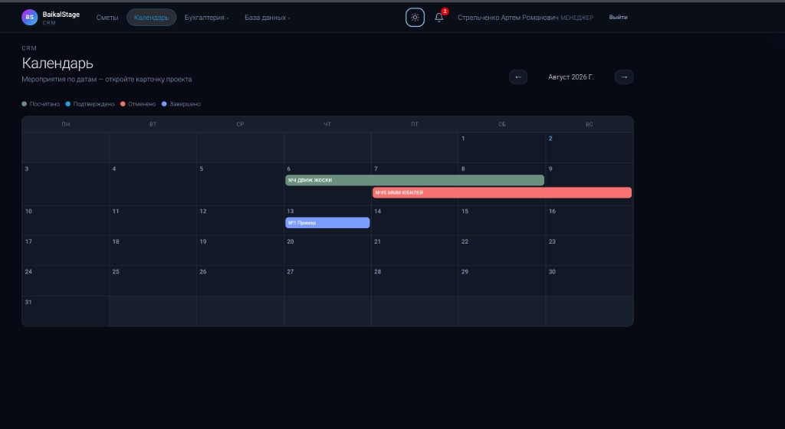
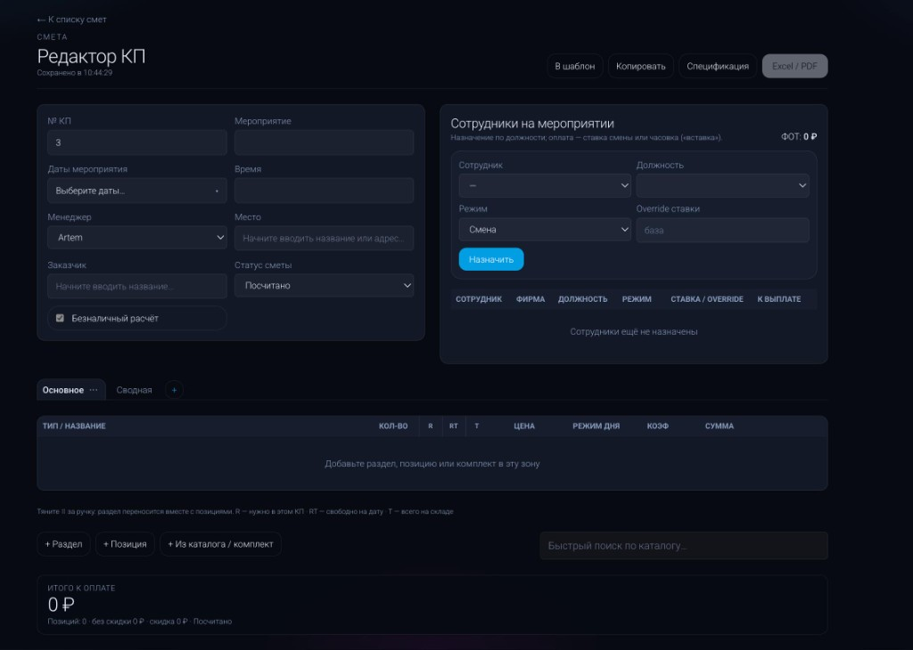
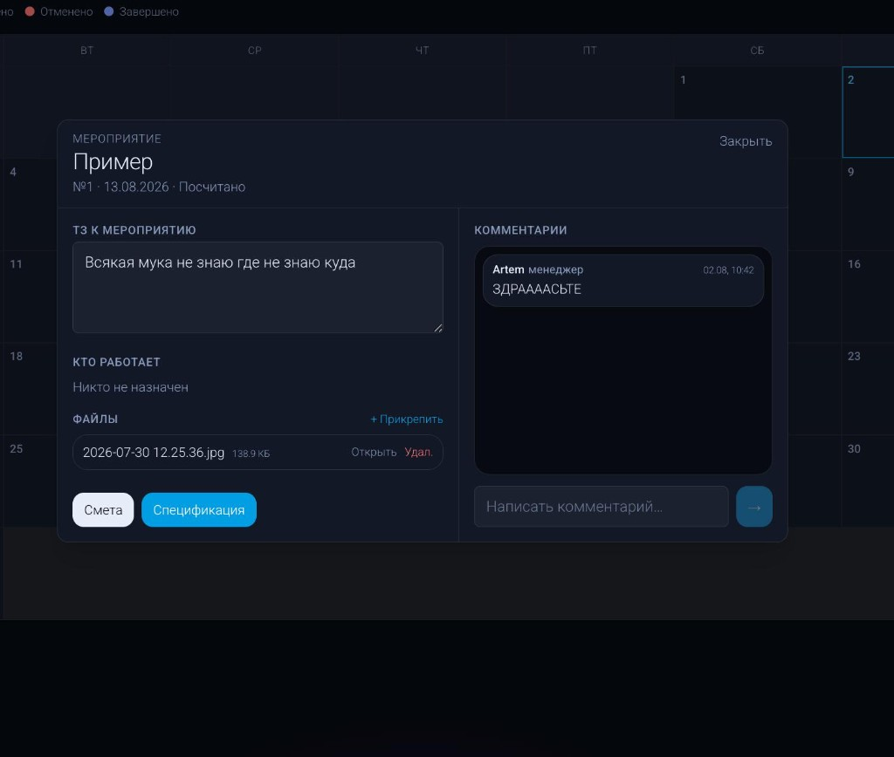
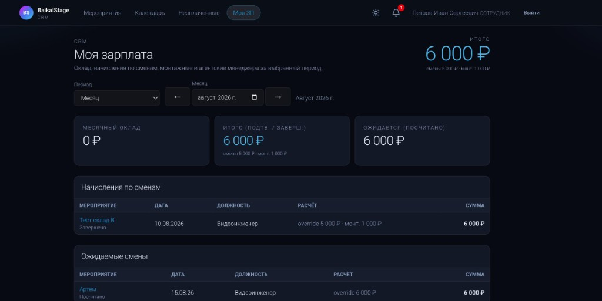
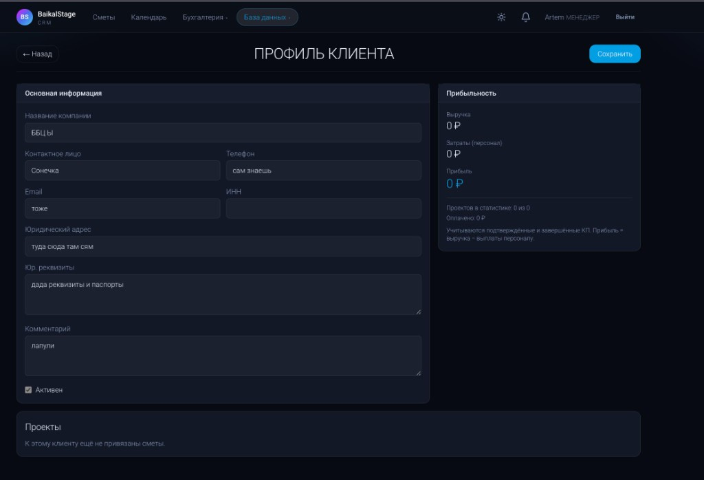
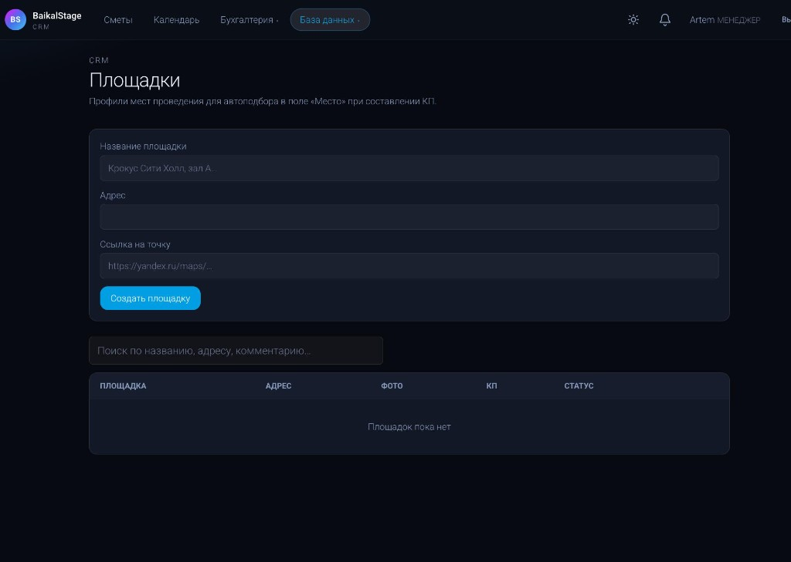
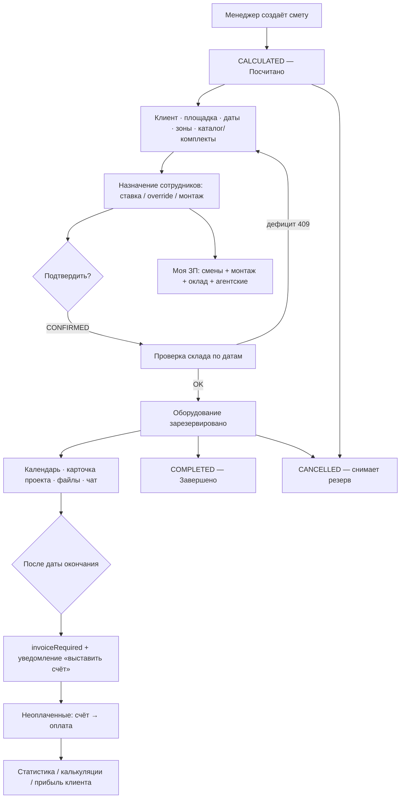

# BaikalStage CRM · v1.1

Веб-CRM для проката ивент-оборудования: коммерческие предложения (сметы), склад, комплекты, календарь, зарплата, бухгалтерия и база клиентов.

**Стек:** Next.js 16 · React 19 · Prisma 6 · PostgreSQL 16 · NextAuth · Caddy (HTTPS) · Docker

---

## Changelog

### v1.1 — 2026-08-03

**Роли и доступы**
- Новая роль **Бригадир** (`BRIGADIER`): видит все мероприятия, правит спецификации, назначает персонал; редактор КП и финансы — только у менеджера
- У сотрудников убрана вкладка «Неоплаченные» (меню + middleware + API) — доступна только менеджерам
- Список «Мероприятия» у сотрудника — только назначенные на него события
- Календарь показывает **все** мероприятия всем авторизованным ролям
- Карточка проекта / спецификация / комментарии доступны любому авторизованному; полные данные сметы у сотрудника — только при назначении

**Спецификации**
- Комментарии к позициям и замена позиции из каталога (`SET_COMMENT`, `REPLACE`)
- Из packing list исключены `PERSONNEL` / `SERVICE`; блок «Технический персонал» строится из назначений
- Правки спецификации: менеджер и бригадир; экспорт Excel/PDF с комментариями и техперсоналом

**Транспорт**
- Справочник транспорта (`Vehicle`): госномер, марка/модель, расход, пробег и др.
- CRUD + страницы `/vehicles` в разделе «База данных» (менеджер)

**Даты монтажа / демонтажа**
- У сметы: диапазоны `mountDate`/`demountDate` и длительности вместо одного дня
- Отображение в редакторе КП, карточке проекта и календаре (полоса события расширяется на монтаж/демонтаж)

**Аккаунт**
- Смена своего пароля из профиля (`ChangePasswordModal` + `POST /api/me/password`)

**Документация**
- README расширен: фичи, дерево логики, скриншоты, команды дебага на VPS

### v1.0 — 2026-08-02

- Первый релиз: сметы/КП, склад, комплекты, календарь, ЗП, бухгалтерия, клиенты/площадки, Docker-установка

---

## Скриншоты

### Календарь мероприятий



Месячная сетка со статусами: посчитано · подтверждено · отменено · завершено.

### Редактор КП (сметы)



Метаданные события, назначение сотрудников, зоны позиций, каталог и итог к оплате.

### Карточка мероприятия



ТЗ, команда, файлы, комментарии, быстрый переход к смете и спецификации.

### Моя зарплата



Начисления по сменам, монтаж, оклад и ожидаемые выплаты за период.

### Профиль клиента



Реквизиты, прибыльность (выручка − ФОТ) и связанные проекты.

### Площадки



Справочник мест проведения для автоподбора в поле «Место» при составлении КП.

---

## Основные фичи и механизмы

### Сметы / КП
- Создание и редактирование коммерческих предложений (зоны, разделы, позиции, комплекты, заметки)
- Метаданные: № КП, даты события, монтаж/демонтаж (диапазоны), время, менеджер, заказчик, площадка, безнал, скидка, статус
- Шаблоны, копирование сметы, сводная вкладка
- Экспорт в **Excel / PDF** (+ HTML-превью)
- Спецификация: комментарии, замена позиций, техперсонал из назначений; правки менеджер/бригадир; отдельный экспорт

### Склад и каталог
- Вложенный каталог с карточкой позиции (фото, габариты, мощность, остаток, владелец ШМ/ДК/НИ)
- Комплекты: в смете одна позиция, на складе учитывается состав
- Резерв при подтверждении: `available = stock − reserved` по пересекающимся датам **CONFIRMED / COMPLETED**
- Блокировка подтверждения при нехватке (HTTP 409 + список дефицита)

### Персонал и ставки
- Назначение на мероприятие: сотрудник · должность · режим (смена / почасово) · override ставки · монтаж (менеджер и бригадир)
- Справочник должностей и персональных ставок
- Месячный оклад сотрудника
- **Моя ЗП:** оклад + смены + монтаж + агентские менеджера (5%) за выбранный период

### Календарь и проект
- Календарь по датам мероприятий (включая монтаж/демонтаж) с цветовой легендой статусов — виден всем ролям
- Карточка проекта: ТЗ, кто работает, вложения, чат-комментарии

### Бухгалтерия
- Неоплаченные (только менеджер): флаг «нужен счёт» после окончания подтверждённого события
- Статусы оплаты: не оплачено → счёт отправлен → оплачено
- Статистика: прибыль по периоду и по компаниям (Шоу-Мастер / Диаком / НеИвент)
- Калькуляции (P&L по смете): доли выручки, доп. расходы, ФОТ, монтаж

### База данных
- Клиенты: реквизиты, активность, прибыльность, связанные сметы
- Площадки: название, адрес, ссылка на карту, фото — автоподбор в КП
- Транспорт: справочник машин для учёта автопарка
- Пользователи: роли `MANAGER` / `BRIGADIER` / `EMPLOYEE`, активность, специальности

### Система
- Роли и разграничение доступа (middleware + API + `lib/roles`)
- Смена пароля из профиля
- Уведомления: новое мероприятие, назначение, чат, счёт к выставлению
- Светлая / тёмная тема
- Bootstrap при первом деплое: миграции + сид каталога + первый администратор

---

## Дерево логики

### Статусы сметы (`QuoteLifecycle`)

| Код | UI |
|---|---|
| `CALCULATED` | Посчитано |
| `CONFIRMED` | Подтверждено |
| `CANCELLED` | Отменено |
| `COMPLETED` | Завершено |

### Роли

| Возможность | Сотрудник | Бригадир | Менеджер |
|---|---|---|---|
| Список мероприятий (назначенные) | да | да | все |
| Все мероприятия в списке | нет | да | да |
| Редактор КП / финансы | нет | нет | да |
| Спецификация: просмотр | да | да | да |
| Спецификация: правки | нет | да | да |
| Назначение персонала | нет | да | да |
| Календарь (все события) | да | да | да |
| Карточка проекта / комментарии / файлы | да | да | да |
| Каталог / комплекты / клиенты / площадки / транспорт | нет | нет | CRUD |
| Пользователи / ставки | нет | нет | да |
| Моя ЗП | да | да | да |
| Неоплаченные / статистика / калькуляции | нет | нет | да |

### Поток работы



**Цепочка вкратце**

1. Создать КП → статус «Посчитано», уведомление другим менеджерам.
2. Наполнить смету и назначить персонал → уведомление сотруднику.
3. Подтвердить → проверка склада; при успехе резерв на даты события.
4. В работе: календарь, ТЗ, файлы, комментарии.
5. После окончания подтверждённого события → попадание в «Неоплаченные».
6. Деньги: зарплата сотрудников, калькуляции по фирмам, прибыльность клиента (`выручка − ФОТ`).

---

## Установка на сервер (Docker)

Нужны Docker и Docker Compose. Скрипт спросит домен (для HTTPS) и данные первого администратора.

```bash
./install.sh
```

После установки: `https://ВАШ_ДОМЕН`.

**Требования**
- свободные порты **80** и **443**
- домен с A/AAAA на IP сервера (Let's Encrypt через Caddy)

Сервисы: `db` (Postgres) · `app` (Next.js) · `caddy` (прокси + TLS).

---

## Локальный запуск (без Docker-приложения)

```bash
docker compose -f docker-compose.dev.yml up -d
# или: brew services start postgresql@16

cd web
cp .env.example .env   # при первом запуске
npm install
npx prisma migrate deploy
npm run db:seed
npm run dev
```

Откройте [http://localhost:3000](http://localhost:3000).

**Демо (локальный seed)**  
Менеджер: `manager@local.test` / `manager123`  
Бригадир: `brigadier@local.test` / `brigadier123`  
Сотрудник: `employee@local.test` / `employee123`

Сиды каталога: `Пример исходников/Каталог выгрузка с golova.xlsx`.

---

## Команды для дебага на VPS

Все команды — из корня репозитория (где лежит `docker-compose.yml`).

### Статус и логи

```bash
docker compose ps
docker compose logs -f app          # приложение
docker compose logs -f db           # Postgres
docker compose logs -f caddy        # TLS / прокси
docker compose logs --tail=200 app  # последние строки
```

### Перезапуск и пересборка

```bash
docker compose restart app
docker compose up -d                # поднять без пересборки
docker compose up -d --build        # пересобрать образы и поднять
docker compose build --no-cache app # чистая пересборка app
docker compose down                 # остановить (тома сохраняются)
# docker compose down -v          # ОСТОРОЖНО: удалит pgdata и uploads
```

### Shell внутри контейнеров

```bash
docker compose exec app sh
docker compose exec db psql -U crm -d crm_event
```

Полезные SQL-проверки:

```bash
docker compose exec db psql -U crm -d crm_event -c '\dt'
docker compose exec db psql -U crm -d crm_event -c 'SELECT id, email, role, active FROM "User";'
```

### Миграции и сид

При старте `app` entrypoint сам ждёт БД, делает `prisma migrate deploy` и безопасный bootstrap-seed.

Вручную:

```bash
docker compose exec app npx prisma migrate deploy
docker compose exec app npx tsx prisma/seed.ts
docker compose exec app npx prisma migrate status
```

### Диагностика «сайт не открывается»

```bash
docker compose ps
curl -I http://127.0.0.1          # Caddy на 80
docker compose logs --tail=100 caddy
docker compose logs --tail=100 app
ss -tlnp | grep -E ':80|:443'     # кто слушает порты
dig +short ВАШ_ДОМЕН              # A-запись должна указывать на VPS
```

### Бэкап и восстановление Postgres

```bash
# бэкап
docker compose exec -T db pg_dump -U crm crm_event > backup-$(date +%F).sql

# восстановление
cat backup-YYYY-MM-DD.sql | docker compose exec -T db psql -U crm -d crm_event
```

### Обновление релиза на VPS

```bash
git pull
docker compose up -d --build
docker compose logs -f app          # убедиться, что migrate + start прошли
```

---

## Переменные окружения (prod `.env`)

| Переменная | Назначение |
|---|---|
| `DOMAIN` | Хост для Caddy / Let's Encrypt |
| `POSTGRES_USER` / `POSTGRES_PASSWORD` / `POSTGRES_DB` | Учётка Postgres |
| `DATABASE_URL` | Строка Prisma (`@db:5432` в compose) |
| `AUTH_SECRET` | Секрет NextAuth |
| `AUTH_URL` | `https://$DOMAIN` |
| `BOOTSTRAP_MODE` | `prod` — идемпотентный первый сид |
| `BOOTSTRAP_MANAGER_EMAIL` / `_PASSWORD` / `_NAME` | Первый администратор |
| `CATALOG_XLSX` | Путь к Excel каталога в контейнере |

Файл `.env` создаёт `./install.sh`; в git он не коммитится.
