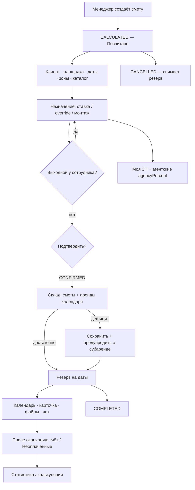
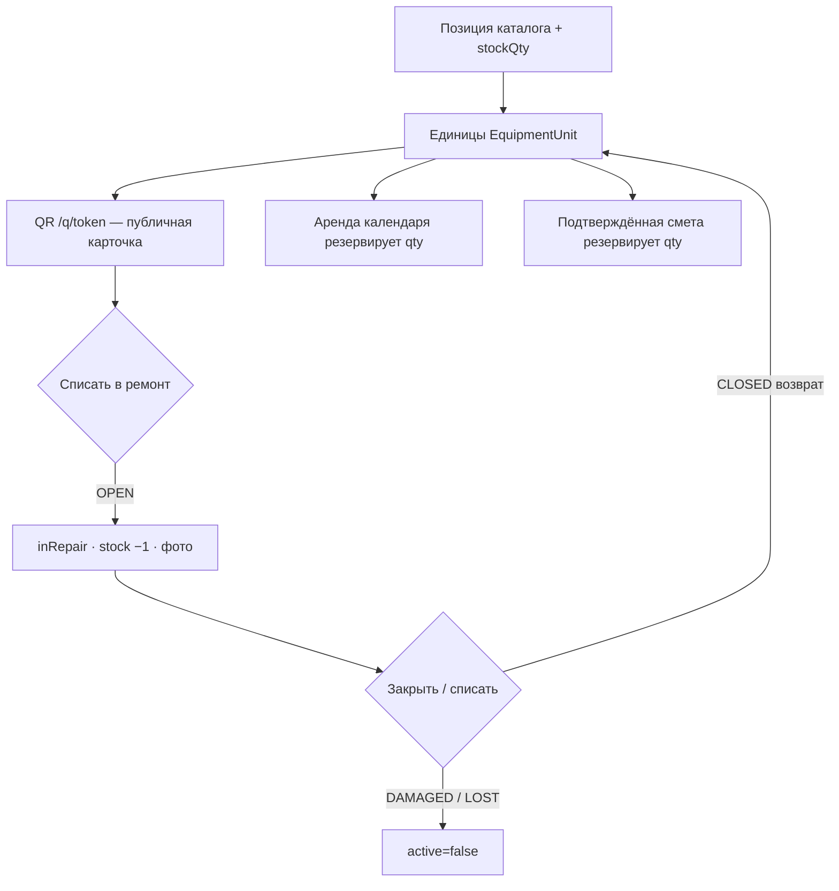

# BaikalStage CRM · v1.4.0

Веб-CRM для проката ивент-оборудования: коммерческие предложения (сметы), склад с QR-единицами, ремонты, календарь и срост, зарплата, бухгалтерия и база клиентов.

**Стек:** Next.js 16 · React 19 · Prisma 6 · PostgreSQL 16 · NextAuth · Caddy (HTTPS) · Docker

---

## Интерфейс

Снимки с локальной демо-базы (тёмная тема, август 2026). Обновить: поднять `npm run dev` и выполнить `node scripts/capture-readme-screenshots.mjs`.

<p align="center">
  
</p>
<p align="center"><em>Календарь — стартовая страница: мероприятия, аренда, задачи и сводка дня</em></p>

<table>
<tr>
<td width="50%"><br><sub>Смета: зоны, каталог сбоку, коэффициенты</sub></td>
<td width="50%"><br><sub>Срост: лента занятости и назначение DnD</sub></td>
</tr>
<tr>
<td width="50%"><br><sub>Карточка КП: даты, монтаж/демонтаж, контакт, файлы</sub></td>
<td width="50%"><br><sub>Команда: дни, зоны, монтажники М / Д</sub></td>
</tr>
<tr>
<td width="50%"><br><sub>Спецификация-снимок с вкладками зон</sub></td>
<td width="50%"><br><sub>Каталог склада: дерево разделов и позиции</sub></td>
</tr>
<tr>
<td width="50%"><br><sub>Моя ЗП: оклад, смены, монтаж, агентские</sub></td>
<td width="50%"><br><sub>Статистика: выручка, затраты, прибыль</sub></td>
</tr>
<tr>
<td width="50%"><br><sub>Экран входа</sub></td>
<td width="50%"><br><sub>Мобильная вёрстка календаря и сводки</sub></td>
</tr>
</table>

Дополнительно в `docs/screenshots/`: список смет, неоплаченные, калькуляции, клиенты, площадки, ремонты, юрлица.

---

## Changelog

### v1.4.0 — 2026-08-25

Полный список относительно **v1.3.0** (21 августа → 25 августа). Коммиты `d90c5d2` (beta) и `0b9ce28`: **~154 файла**, **+13 000 / −2 000** строк.

Крупный апдейт сроста, назначений по дням и зонам, спецификации, PDF/шрифтов, прав бригадира, полного бэкапа и данных на диске.

#### Срост (`/roster`)

Новый раздел загруженности персонала — в меню **Учёт** у менеджера и бригадира. Сотрудник туда не ходит (`canAccessRoster` + проверка в `middleware`).

- Лента: кто занят на мероприятии, аренде и задаче; монтаж рисуется отдельно
- Назначение **перетаскиванием** на слот, растягивание краёв (`/api/roster/span`), снятие крестиком
- Панель сотрудников справа; фильтры по типу записи и владельцам склада **SHM / DK / NE**
- Конфликты расписания (пересечение смен, выходной) — предупреждение
- Индикатор относительного заработка за выбранный месяц
- API: `GET /api/roster`, `POST /api/roster/move`, `POST /api/roster/span`
- Логика: `roster.ts`, `roster-server.ts`; тесты `roster.test.ts`

#### Назначения: дни, зоны, монтаж / демонтаж

Схема `QuoteAssignment` дополнена полями:

| Поле | Смысл |
|---|---|
| `zoneId` | зона сметы, из которой пришёл слот (можно сменить вручную) |
| `dayIndex` | рабочий день мероприятия, 1-based; `null` = все дни / монтажник |
| `onMount` / `onDemount` | флаги М / Д у монтажника; по умолчанию оба `true` |

Миграции: `assignment_zone`, `assignment_day_index`, `assignment_mount_duty`.

- Вкладка **Команда**: **День 1…N**; если состав одинаковый на всех днях — общий список
- Слоты из строк персонала сметы наследуют зону должности
- Монтажники отдельно от участников шоу; назначение на М или Д из сроста сливает маркеры в одну строку
- Копирование сметы, история и восстановление переносят зону, день и флаги М/Д
- Логика: `quote-assignment-days.ts`, `quote-assignment-slots.ts`, `quote-mount-duty.ts`

#### Спецификация и смета

- Спека — по-прежнему **снимок**; в UI появились вкладки зон (как в смете), включая «Без зоны»
- У позиции спеки хранятся `zoneId` / имя / порядок / активность зоны; новая строка попадает в активную вкладку
- Поле **«Контактная информация»** (`Quote.requestContact`) — телефон / Telegram / заметка с заявки
- Позиции каталога **перетаскиваются** из боковой панели в смету (`catalog-dnd.ts`)
- Единый `FileDrop`: файлы сметы и вложения в модалке проекта (календарь)
- Карточка КП: вкладки Основное / Смета / Спека / История / Команда / Документы

#### PDF, Excel и шрифты

- Интерфейс: **Golos Text** Variable вместо Roboto (`@fontsource-variable/golos-text`)
- PDF сметы и юрдоков: **DocSans / DocSerif** (`web/public/fonts/`), fallback Noto Sans (`pdf-fonts.ts`)
- Единая шапка КП (`kp-header.ts`): бренд, контакт от заказчика, менеджер **с телефоном**
- PDF/Excel сметы: цвета зон, дисклеймер, разбиение страниц по зонам (`estimate-layout.ts`, `quote-zones.ts`)
- Excel: отдельный лист на зону **или** все вкладки на одном листе; цены оборудования / расходников / услуг — отдельно
- Договор, счёт и акт пересобраны под новые шрифты и банковский блок (`legal-docs-pdf.ts`)

#### Роли, бригадир, пользователи

- Бригадир видит смету **только для чтения** (`canViewQuote`), без правок блоков и зон
- Бригадир может: срост; ТЗ; даты / время / монтаж / демонтаж; файлы мероприятия
- Жёсткий whitelist PATCH: `brief`, `date`, `durationDays`, `time`, `mountDate`, `mountDurationDays`, `demountDate`, `demountDurationDays`. Любое другое поле → 403
- Массовые операции пользователей: роль, вкл/выкл, специальность; **нельзя выключить или разжаловать последнего админа** (`user-bulk.ts`)
- Назначать менеджеров и админов по-прежнему может только админ

#### Интерфейс

- Переключатель **мобильная / полная** версия (иконка телефона) и сброс в «Авто» (`bs-crm-layout`)
- Единый ввод цены `PriceInput`
- Обновлённые таблицы, модалки и визуальные токены в `globals.css`

#### Полный бэкап, данные на диске, деплой

- Полный снимок: Postgres (`pg_dump -Fc`) + `uploads` → `backups/crm-full-YYYYMMDD-HHMM.tar.gz` (`manifest.json`, `postgres.dump`, `uploads/`)
- В UI **База данных → Экспорт / импорт**: создать и скачать снимок (`FullBackupAdmin`, `GET/POST /api/database/full-backup`). Restore из браузера нет
- Восстановление: `./scripts/restore.sh` (`--dry-run`, `--yes`)
- `backup-cron.sh` — ежедневный снимок; ротация по умолчанию 14 файлов
- Данные на хосте: `./data/postgres`, `./data/uploads` (bind-mount в compose вместо именованных томов `pgdata` / `uploads`)
- Переезд со старых томов: `./scripts/migrate-volumes-to-data.sh`
- Сборка образа на ноутбуке и упаковка на VPS: `./scripts/pack-vps-archive.sh`
- JSON-бэкап справочников на `/backup` **не** заменяет полный снимок

#### Схема и API (дельта к 1.3)

- `Quote.requestContact`
- `QuoteAssignment.zoneId`, `dayIndex`, `onMount`, `onDemount` + индексы
- `QuoteZone.assignments`
- Новые маршруты: `/roster`, `/api/roster`, `/api/roster/move`, `/api/roster/span`, `/api/database/full-backup`
- Правки: PATCH сметы (whitelist бригадира), назначения, вложения, spec import, duplicate/history, users bulk/csv

#### Тесты (новые и расширенные)

`roster`, `quote-assignment-days`, `quote-assignment-slots`, `quote-mount-duty`, `roles`, `user-bulk`, `catalog-dnd`, `kp-header`, `estimate-layout`, `full-backup`, `spec-build` / `spec-merge`

---

### v1.3.0 — 2026-08-21

Большой апдейт рабочего интерфейса, смет, документов, календаря и финансовой модели.

#### Новый интерфейс и навигация

- Единая оболочка приложения: верхняя навигация на компьютере, мобильные панели и выдвижное меню на телефоне
- Разделы перегруппированы в **Склад**, **Бухгалтерию** и **Базу данных**
- Добавлен переключатель отображения: авто / компьютер / телефон; выбор сохраняется между сессиями
- Таблицы, формы, модальные окна и панели действий адаптированы для компактных экранов
- Календарь стал главной страницей после входа; на телефоне добавлена быстрая кнопка создания записи

#### Календарь и рабочий дашборд

- Рядом с календарём появилась сводка: неоплаченные счета, незакрытые позиции персонала, задачи, аренды и личные мероприятия
- Задачи можно отмечать выполненными прямо в сводке; добавлены уведомления по открытым задачам
- Добавлены приветствие, локальное время и погода; часовой пояс и регион погоды настраиваются в профиле
- У компании появился мастер-часовой пояс, по умолчанию `Asia/Irkutsk`
- Запись календаря теперь можно связать с клиентом

#### Сметы и спецификации

- Редактор сметы получил быстрый поиск по каталогу, боковую панель добавления позиций и обновлённые вкладки зон
- Основное, смета, спецификация, история, команда и документы собраны во вкладках одной карточки
- Зоны можно скрывать без удаления данных и исключать из суммы и складского резерва; улучшены шаблоны и копирование
- Добавлены CSV импорт/экспорт списка смет и массовое удаление/копирование
- В списке смет появились фильтр по периоду и сортировка относительно текущей даты
- История сметы хранит именованные снимки и журнал изменений; выбранную версию можно восстановить
- Спецификация стала **снимком**: смена статуса сметы больше не пересобирает её автоматически
- Кнопка **«Импорт из сметы»** показывает сравнение и явно обновляет спецификацию; ревизии можно именовать и восстанавливать
- Нехватка оборудования больше не блокирует сохранение: смета сохраняется с предупреждением и количеством для субаренды
- Для подтверждённого или завершённого мероприятия теперь обязательно выбрать площадку
- Файлы сметы можно добавлять перетаскиванием, просматривать и удалять

#### Персонал, слоты и монтаж

- Участники мероприятия и монтажники разделены на независимые назначения
- Поддерживаются пустые слоты по должностям: сотрудника можно назначить позже
- Монтажников можно добавлять сверх состава сметы; один человек может одновременно участвовать в шоу и монтаже
- Добавлены подтверждения монтажа, уведомления и защита от повторного автоматического добавления удалённых слотов
- В справочнике ставок появилось описание специальности

#### Юрлица и документы

- Новый справочник **База данных → Юрлица**: реквизиты, банковские счета, привязка к SHM / DK / NE, печать, подпись и активность
- Карточку предприятия можно заполнить из вставленного текста или файла `.txt`, `.rtf`, `.doc`, `.docx`
- Из сметы формируется комплект PDF: договор, счёт и акт; дополнительно прикладываются смета PDF и Excel
- Сформированные документы сохраняются в архиве сметы, доступны для просмотра и удаления
- Для счёта добавлена отметка **«отправлен заказчику»**

#### Каталог, склад и QR

- Каталог переработан: дерево разделов, поиск, множественный выбор и общая панель действий
- Для позиции добавлены себестоимость и флаг показа в каталоге сметы
- Добавлены массовые операции с разделами и позициями
- QR-коды выбранных позиций и физических единиц можно открыть отдельным листом для печати
- Бывшая страница `/equipment` объединена с каталогом
- В разделе ремонта появился QR-сканер с камерой и загрузкой фотографии

#### Калькуляции и бухгалтерия

- Финансовая модель разделяет цену клиенту, закуп, маржу, зарплату и дополнительные расходы
- В доход компании попадает маржа `цена клиенту − закуп`, а закуп учитывается отдельно
- У услуг без указанного закупа маржа равна цене клиенту; passthrough-расходы без закупа целиком относятся в расход
- Калькуляция разделена на вкладки **Смета / Сотрудники / Доходы**
- Добавлены CSV импорт/экспорт строк и персонала, CSV доходов и выгрузка калькуляции в Excel
- Монтаж и участие в мероприятии считаются раздельно; перерасход уменьшает маржу, не увеличивая выручку
- В «Неоплаченных» появились массовые отметки «счёт отправлен» и «оплачено» с цветовой индикацией
- Статистика и зарплата обновлены под новую модель расходов и назначений

#### Справочники, данные и надёжность

- Единые поиск, выбор строк, копирование, отключение и CSV импорт/экспорт для клиентов, площадок, транспорта, сотрудников, ставок и комплектов
- JSON-бэкап расширен новыми настройками и справочниками
- Прод-схема дополнена идемпотентными миграциями для снимков, ревизий, юрлиц, себестоимости, слотов, задач и документов
- Добавлены тесты финансовых формул, CSV, снимков спецификации, истории, слотов, QR, часовых поясов и складских предупреждений

---

### v1.2.1 — 2026-08-13

Крупный апдейт склада, календаря и справочников. Ниже — всё, что вошло в этот релиз.

#### Склад: единицы оборудования и QR

- У каждой позиции каталога появляются **физические единицы** (`EquipmentUnit`): номер, метка, QR-токен, флаги «в ремонте» / «списана»
- Публичный код позиции `equipmentCode` (с ~1001); ID единицы в UI: `{код}-{номер}` (например `1001-3`)
- Раздел **База данных → Склад** (`/equipment`): дерево категорий, карточка позиции, список единиц, документы (PDF/Excel/фото до 15 МБ)
- QR-код на единицу ведёт на публичную карточку **`/q/[token]`** (без логина для просмотра)
- Списание единицы: `DAMAGED` / `LOST` — единица деактивируется, открытый ремонт закрывается
- CSV импорт/экспорт склада: позиции и единицы отдельно (`/api/equipment/export`, `/api/equipment/import`)
- Синхронизация единиц с остатком `stockQty` (`syncEquipmentUnits`, скрипт `web/scripts/sync-equipment-units.mjs`)

#### Ремонт

- Заявки `OPEN` → `CLOSED` с фото поломки (до 8 jpg/png)
- Типы: не включается, нет сигнала, кабель, корпус, оптика, перегрев, другое
- Раздел **База данных → Ремонт** (`/repairs`) — менеджер и бригадир: список открытых, возврат на склад с комментарием
- С публичной QR-карточки любой авторизованный (**включая сотрудника**) может нажать «Списать в ремонт»
- При отправке в ремонт: `inRepair=true`, **остаток склада −1**; при возврате остаток возвращается

#### Календарь: не только сметы

- Новые виды записей (`CalendarEntryKind`):
  - **Аренда оборудования** (`RENTAL`) — только менеджер; позиции + qty; резервирует склад
  - **Задача** (`TASK`) — менеджер и бригадир; исполнители
  - **Выходной** (`DAY_OFF`) — менеджер и бригадир; сотрудник + интервал времени
- Меню создания по клику на день: Проект / Аренда / Задача / Выходной
- Плотность сетки (compact / comfort / roomy), полные недели соседних месяцев, фильтр «скрыть выходные»
- Конфликты при назначении на смету:
  - **выходной блокирует** назначение
  - пересечение с другим событием / арендой / задачей — предупреждение, можно назначить принудительно
- Аренда календаря учитывается в `stock.ts` наряду с подтверждёнными сметами

#### Импорт / экспорт справочников

- **CSV каталога:** 21 колонка (включая «Код оборудования») — `GET/POST /api/catalog/export|import`
- **JSON backup** (`/backup`): снимок справочников (`kind: baikal-crm-database`)
  - Входит: специальности, пользователи, ставки, каталог, комплекты, клиенты, площадки, транспорт, единицы и документы оборудования, шаблоны смет
  - **Не входит:** сметы, назначения, календарные записи, ремонты, уведомления, медиафайлы
  - **Не заменяет** полный снимок (`pg_dump` + `uploads`)
- Prod-bootstrap **больше не заливает демо-каталог** — каталог импортируется отдельно

#### Финансы

- **`User.agencyPercent`** — агентские менеджера проекта, база **5%** от (выручка − расходы − ЗП − монтажные); правит менеджер или админ в карточке сотрудника
- **`Quote.cashlessPercent`** — % начисления безнала, база **10%**; формула `CEILING.MATH(нал / (1 − %/100), 10)`; поле «Начисление, %» в смете и шаблоне
- Проценты прокидываются в калькуляции, «Моя ЗП», статистику, дублирование сметы и шаблоны

#### Роли и навигация

- **Бригадир** получает: Склад, Ремонт, Каталог/база, статистику **нагрузки без ФОТ** (кто где работал)
- **Сотрудник:** «Моя ЗП», календарь всех событий, QR → ремонт; без «Неоплаченных» и без склада
- JSON backup и полный снимок — только админ (первый пользователь становится админом)
- Публичные маршруты: `/q/*`, `/api/q/*`

#### Docker / prod

- Образ **без** встроенного Excel-каталога (`CATALOG_XLSX` убран)
- Сборка `next build --webpack` (Turbopack в Docker слишком медленный)
- Идемпотентные `ALTER` в `ensure-schema` + `scripts/fix-prod-db-columns.sh` для drift на живой БД
- Зависимость `qrcode` для PNG QR
- Данные в `./data` (не Docker-тома); полный снимок `./scripts/backup.sh` и блок на `/backup`

---

### v1.1 — 2026-08-03

**Роли и доступы**
- Роль **Бригадир** (`BRIGADIER`): все мероприятия, спецификации, назначения; редактор КП и финансы — только менеджер
- У сотрудников убрана вкладка «Неоплаченные»
- Список «Мероприятия» у сотрудника — только назначенные; календарь — все события

**Спецификации**
- Комментарии и замена позиции (`SET_COMMENT`, `REPLACE`); техперсонал из назначений

**Транспорт, монтаж/демонтаж, пароль**
- Справочник машин; диапазоны монтажа/демонтажа в смете и календаре; смена пароля из профиля

### v1.0 — 2026-08-02

- Первый релиз: сметы/КП, склад-остатки, комплекты, календарь, ЗП, бухгалтерия, клиенты/площадки, Docker-установка

---

## Основные фичи и механизмы

### Сметы / КП
- Создание и редактирование КП: зоны, разделы, позиции, комплекты, заметки
- Метаданные: № КП, даты события, монтаж/демонтаж, время, менеджер, заказчик, площадка, безнал, **% начисления**, скидка, статус
- Шаблоны, копирование, сводная вкладка, экспорт Excel / PDF
- Именованные снимки и история восстановления сметы
- Спецификация-снимок: зоны, комментарии, замена позиций, явный импорт из сметы и история ревизий

### Склад, единицы, QR
- Каталог с деревом категорий + карточка позиции
- Физические единицы с QR; публичная страница `/q/[token]`
- Документы к позиции; списание DAMAGED/LOST
- Резерв: `available = stock − reserved` по **CONFIRMED/COMPLETED** сметам **и арендам календаря**
- При дефиците смета сохраняется с предупреждением и расчётом субаренды
- CSV каталога и склада

### Ремонт
- Заявка с типом поломки, комментарием и фото
- С QR — любой сотрудник; очередь и закрытие — менеджер/бригадир
- Остаток склада уменьшается на время ремонта и возвращается при закрытии

### Персонал и ставки
- Назначение: должность · смена/почасово · override · монтаж / демонтаж · зона · день
- Выходной блокирует назначение; пересечение смен — предупреждение
- Месячный оклад; **Моя ЗП:** оклад + смены + монтаж + агентские менеджера (`agencyPercent`)

### Календарь и срост
- Сметы по датам + аренда / задачи / выходные
- Карточка проекта: ТЗ, команда, файлы, чат
- **Срост** (`/roster`): лента загруженности, DnD-назначения, фильтры, конфликты

### Бухгалтерия
- Неоплаченные (менеджер): счёт после окончания подтверждённого события
- Статистика: менеджер — прибыль по фирмам; бригадир — нагрузка без ФОТ
- Калькуляции P&L: доли выручки, расходы, ФОТ, монтаж, агентские

### База данных
- Клиенты, юрлица, площадки, транспорт, пользователи, ставки
- Склад и ремонт
- JSON-экспорт справочников и полный снимок БД+файлов (только админ)

### Система
- Роли `ADMIN` / `MANAGER` / `BRIGADIER` / `EMPLOYEE`
- Смена пароля, уведомления, светлая/тёмная тема
- Prod bootstrap: миграции + админ + специальности, **каталог пустой**

---

## Дерево логики

### Статусы сметы (`QuoteLifecycle`)

| Код | UI |
|---|---|
| `CALCULATED` | Посчитано |
| `CONFIRMED` | Подтверждено |
| `CANCELLED` | Отменено |
| `COMPLETED` | Завершено |

### Записи календаря (`CalendarEntryKind`)

| Код | UI | Кто создаёт | Склад |
|---|---|---|---|
| `RENTAL` | Аренда | менеджер | резерв qty |
| `TASK` | Задача | менеджер, бригадир | — |
| `DAY_OFF` | Выходной | менеджер, бригадир | — (блокирует назначение) |

### Ремонт (`EquipmentRepairStatus`)

`OPEN` (единица в ремонте, stock −1) → `CLOSED` (возврат на склад или списание)

### Роли

| Возможность | Сотрудник | Бригадир | Менеджер | Админ |
|---|---|---|---|---|
| Список мероприятий (назначенные) | да | все | все | все |
| Редактор КП / финансы / неоплаченные / калькуляции | нет | нет | да | да |
| Спецификация: просмотр | да | да | да | да |
| Спецификация: правки | нет | да | да | да |
| Назначение персонала | нет | да | да | да |
| Календарь (все события) | да | да | да | да |
| Календарь: аренда / новый проект | нет | нет | да | да |
| Календарь: задача / выходной | нет | да | да | да |
| Срост | нет | да | да | да |
| Склад / ремонт (раздел) | нет | да | да | да |
| QR → списать в ремонт | да | да | да | да |
| Каталог / комплекты / клиенты / площадки / транспорт | нет | да | да | да |
| Пользователи / ставки / `agencyPercent` | нет | нет | да | да |
| Назначать менеджеров | нет | нет | нет | да |
| Сброс пароля пользователям | нет | нет | нет | да |
| Статистика | нет | нагрузка без ФОТ | полная | полная |
| Моя ЗП | да | да | да | да |
| JSON / полный снимок `/backup` | нет | нет | нет | да |

### Поток сметы


```mermaid
flowchart TD
  A[Менеджер создаёт смету] --> B[CALCULATED — Посчитано]
  B --> C[Клиент · площадка · даты · зоны · каталог]
  C --> D[Назначение: ставка / override / монтаж]
  D --> D1{Выходной у сотрудника?}
  D1 -->|да| D
  D1 -->|нет| E{Подтвердить?}
  E -->|CONFIRMED| F[Склад: сметы + аренды календаря]
  F -->|дефицит| F1[Сохранить + предупредить о субаренде]
  F -->|достаточно| G[Резерв на даты]
  F1 --> G
  G --> H[Календарь · карточка · файлы · чат]
  H --> I[После окончания: счёт / Неоплаченные]
  G --> L[COMPLETED]
  B --> M[CANCELLED — снимает резерв]
  D --> N[Моя ЗП + агентские agencyPercent]
  I --> O[Статистика / калькуляции]
```

### Поток склада и QR


```mermaid
flowchart TD
  P[Позиция каталога + stockQty] --> U[Единицы EquipmentUnit]
  U --> Q[QR /q/token — публичная карточка]
  Q --> R{Списать в ремонт}
  R -->|OPEN| S[inRepair · stock −1 · фото]
  S --> T{Закрыть / списать}
  T -->|CLOSED возврат| U
  T -->|DAMAGED / LOST| W[active=false]
  U --> Rent[Аренда календаря резервирует qty]
  U --> Quote[Подтверждённая смета резервирует qty]
```

**Цепочка вкратце**

1. Создать КП → «Посчитано», наполнить, назначить персонал (выходной блокирует).
2. Подтвердить → проверка склада (сметы + аренды); при дефиците сохранить предупреждение о субаренде.
3. В работе: календарь, ТЗ, файлы, чат; аренда/задачи/выходные живут рядом со сметами.
4. Поломка: QR → ремонт → очередь `/repairs` → возврат или списание.
5. После события → «Неоплаченные»; деньги: ЗП, агентские %, калькуляции, прибыль клиента.

---

## Установка на сервер (Docker)

Нужны Docker и Docker Compose. Скрипт спросит домен (для HTTPS) и данные первого администратора.

```bash
./install.sh
```

После установки: `https://ВАШ_ДОМЕН`. Каталог в prod **пустой** — загрузите CSV/JSON из «База данных».

**Требования**
- свободные порты **80** и **443**
- домен с A/AAAA на IP сервера (Let's Encrypt через Caddy)

Сервисы: `db` (Postgres) · `app` (Next.js) · `caddy` (прокси + TLS).

Данные на диске хоста: `./data/postgres`, `./data/uploads`, снимки в `./backups`. Так их проще копировать на другой диск или сервер, чем из Docker-томов.

Если обновляете уже работающий сервер со старыми томами `pgdata` / `uploads`:

```bash
./scripts/migrate-volumes-to-data.sh
docker compose up -d
```

Сборка образа: `npx next build --webpack` (в Docker Turbopack сильно тормозит). На слабом VPS удобнее собрать образ на ноутбуке и загрузить.

---

## Локальный запуск (без Docker-приложения)

```bash
docker compose -f docker-compose.dev.yml up -d
# или: brew services start postgresql@16

cd web
cp .env.example .env   # при первом запуске
npm install
npx prisma migrate deploy
npm run db:seed
npm run dev
```

Откройте [http://localhost:3000](http://localhost:3000).

**Демо (локальный seed)**  
Админ: `manager@local.test` / `manager123`  
Менеджер: `pm@local.test` / `manager123`  
Бригадир: `brigadier@local.test` / `brigadier123`  
Сотрудник: `employee@local.test` / `employee123`

Локальный seed может загрузить демо-каталог из  
`Пример исходников/Каталог выгрузка с golova.xlsx`.  
В Docker/prod каталог не сидится.

После миграций v1.2.1 имеет смысл прогнать синхронизацию единиц:

```bash
cd web && node scripts/sync-equipment-units.mjs
```

---

## Команды для дебага на VPS

Все команды — из корня репозитория (где лежит `docker-compose.yml`).

### Статус и логи

```bash
docker compose ps
docker compose logs -f app
docker compose logs -f db
docker compose logs -f caddy
docker compose logs --tail=200 app
```

### Перезапуск и пересборка

```bash
docker compose restart app
docker compose up -d
docker compose up -d --build
docker compose build --no-cache app   # только если кэш реально сломан
docker compose down                   # ./data и ./backups сохраняются
# rm -rf data                       # ОСТОРОЖНО: удалит Postgres и uploads
```

### Shell внутри контейнеров

```bash
docker compose exec app sh
docker compose exec db psql -U crm -d crm_event
```

```bash
docker compose exec db psql -U crm -d crm_event -c '\dt'
docker compose exec db psql -U crm -d crm_event -c 'SELECT id, email, role, active FROM "User";'
docker compose exec db psql -U crm -d crm_event -c 'SELECT COUNT(*) FROM "EquipmentUnit";'
```

### Миграции и сид

Entrypoint ждёт БД, делает `prisma migrate deploy` и безопасный bootstrap (админ + специальности, без каталога).

```bash
docker compose exec app npx prisma migrate deploy
docker compose exec app npx tsx prisma/seed.ts
docker compose exec app npx prisma migrate status
```

Если на живой БД не хватает колонок (старый том):

```bash
./scripts/fix-prod-db-columns.sh
```

### Диагностика «сайт не открывается»

```bash
docker compose ps
curl -I http://127.0.0.1
docker compose logs --tail=100 caddy
docker compose logs --tail=100 app
ss -tlnp | grep -E ':80|:443'
dig +short ВАШ_ДОМЕН
```

### Бэкап и переезд

**Полный снимок** (Postgres + файлы `uploads`) — это disaster recovery и перенос на другой сервер. JSON на `/backup` копирует только справочники и **не** заменяет полный снимок.

Снимок: `backups/crm-full-YYYYMMDD-HHMM.tar.gz` (`manifest.json`, `postgres.dump`, `uploads/`).

```bash
./scripts/backup.sh                          # создать снимок, ротация 14 штук
BACKUP_KEEP=7 ./scripts/backup.sh
./scripts/backup-cron.sh                     # строка для crontab (ежедневно в 03:00)
./scripts/restore.sh --dry-run backups/crm-full-YYYYMMDD-HHMM.tar.gz
./scripts/restore.sh backups/crm-full-YYYYMMDD-HHMM.tar.gz
./scripts/restore.sh --yes backups/crm-full-YYYYMMDD-HHMM.tar.gz
```

В UI: **База данных → Экспорт / импорт** — «Создать снимок» и скачивание. Restore из браузера нет.

**Переезд на новый VPS (архив):**

```bash
# на старом
./scripts/backup.sh
scp backups/crm-full-*.tar.gz user@NEW:/var/www/bsg-crm/backups/

# на новом
./install.sh                                 # или git clone + docker compose up -d
./scripts/restore.sh --yes backups/crm-full-YYYYMMDD-HHMM.tar.gz
```

**Переезд «как есть» (диск):**

```bash
rsync -aH --numeric-ids ./data ./backups .env user@NEW:/var/www/bsg-crm/
# на новом: docker compose up -d
```

Каталог `./data` можно держать на втором диске или NAS (примонтировать в `./data`) — код менять не нужно.

**Справочники (JSON из UI):** страница `/backup` — обмен каталогом/клиентами между стендами, не полный бэкап.

### Обновление релиза на VPS

На слабом VPS (`next build` в Docker часто «висит» на шаге webpack 10–20+ мин или уходит в swap). Надёжнее собрать образ на ноутбуке:

```bash
# на ноутбуке, из корня репо
./scripts/docker-build-export.sh user@VPS:/var/www/bsg-crm
# на VPS:
cd /var/www/bsg-crm
gunzip -c crm-app.tar.gz | docker load
git pull   # compose/Caddy/миграции
docker compose up -d
```

Если всё же собираете на сервере:

```bash
git pull
# не используйте --no-cache без нужды
DOCKER_BUILDKIT=1 docker compose up -d --build
docker compose logs -f app
```

Если шаг `next build` снова стоит дольше ~25 мин — прервите, проверьте `free -h` (нужен swap ≥2G) и соберите образ на ноутбуке.

---

## Переменные окружения (prod `.env`)

| Переменная | Назначение |
|---|---|
| `DOMAIN` | Хост для Caddy / Let's Encrypt |
| `POSTGRES_USER` / `POSTGRES_PASSWORD` / `POSTGRES_DB` | Учётка Postgres |
| `DATABASE_URL` | Строка Prisma (`@db:5432` в compose) |
| `AUTH_SECRET` | Секрет NextAuth |
| `AUTH_URL` | `https://$DOMAIN` |
| `BOOTSTRAP_MODE` | `prod` — идемпотентный первый сид (без каталога) |
| `BOOTSTRAP_MANAGER_EMAIL` / `_PASSWORD` / `_NAME` | Первый администратор |

Файл `.env` создаёт `./install.sh`; в git он не коммитится.
